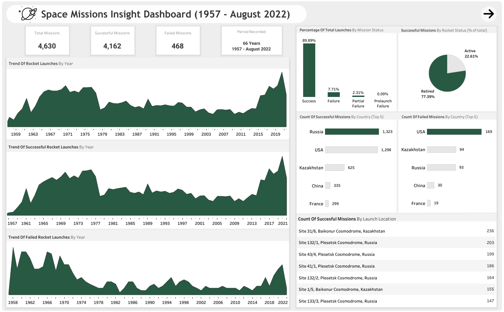
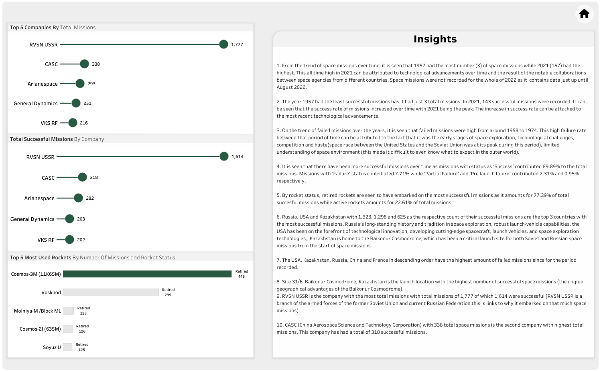

# Space Missions
Analysis of dataset containing space missions from 1957 to August of 2022.

---

> [Introduction](https://github.com/Afokoghene/Space-Missions/#introduction) <br>
> [Problem Statement](https://github.com/Afokoghene/Space-Missions/#problem-statement) <br>
> [Skills Demonstrated](https://github.com/Afokoghene/Space-Missions/#skills-demonstrated) <br>
> [Data Sourcing](https://github.com/Afokoghene/Space-Missions/#data-sourcing) <br>
> [Data Assessment and Transformation](https://github.com/Afokoghene/Space-Missions/#data-assessment-and-transformation) <br>
> [Data Analysis](https://github.com/Afokoghene/Space-Missions/#data-analysis) <br>
> [Data Visualization](https://github.com/Afokoghene/Space-Missions/#data-visualization) <br>
> [Insights](https://github.com/Afokoghene/Space-Missions/#insights) <br>

---

## Introduction

  Rocket launches began sometime in 1957, the first successful launch was conducted by the Soviet Union (RVSN USSR).
  On October 4, 1957, the Soviet Union launched the earth's first artificial satellite, Sputnik I. The successful launch came as a shock to the United State of America as they believed they were working hard enough and would be the first to reach that scientific advancement. Launching Sputnik I saw the beginning of the space race between the Soviet Union, the USA and later, other nations. This space race made the USA start the launch of its rocket so they won’t be seen as fallen back, the impromptu launching of rockets caused the USA  major setback in December of 1957 as the its first artificial satellite ‘Vanguard’ exploded on the launch pad. This severe setback served as a very visible reminder of how much the country had yet to accomplish to be able to compete militarily with the Soviets.

  This analysis was done to gain insights on how well or bad rocket launches have performed over the years from the year of the first launch. After the analysis process we’ll be able to see the success and failure rates (in percentage) of space missions, countries with the most space missions, countries with the most successful and most failed space missions. We’ll also be able to see the trend of successful and failed space missions over time and with little research see what may have caused these successes and failures.

---

## Problem Statement

The probelme statement fro this analysis are the preset questions that can withthe dataset frrom the source of the data. I also did add a few questions of mine.

1. Show the trend of rocket launches over time
2. Show the trend of successful rocket launches over time
3. Show the trend of failed rocket launches of time (failed rocket launches should include missions with status as 'failure', 'partial failure', 'pre launch failure')
4. What is the percentage of total rocket launches by missions status?
5. What is the count of successful missions by country?
6. What is the count of failed missions by country?
7. Show the top 10 companies with the most rocket launches
8. Top 5 companies by total count of missions
9. Top 5 companies by succesful missions
10. How does the mission success rate vary between active and inactive rockets?
11. Top 5 most used rockets by number of missions and rocket status.

---

## Skills Demonstrated
- Cleaning, transformation of data to a useable structure using Microsoft Excel.
- Analysis of cleaned data using SQL.
- Visualization of data cleaned and analyzed data using Tableau.

---

## Data Sourcing
The dataset was obtained from [Maven Analytics'](https://www.mavenanalytics.io/data-playground?accessType=open&dataStructure=5wfxyeVf1etbP4TXdyPdG1) website where datasets are generally available for practice purposes.

---

## Data Assessment and Transformation
### Assessment
The dataset was first opened using Micrsoft Excel and I noticed that it contained 4630 rows and 10 columns.
Below are the column headers and the type of data each columnholds.

1. Company: This column holds the  name of the company responsible for each space mission.
2. Location: Ths column holds the location of launch for each space rocket.
3. Country: This holds the country of launch for each space rocket.
4. Date: This column holds the day each space rocket took place.
5. Time: This holds the exact time each space rocket took off.
6. Rocket: This column contains the name of the rocket used for that mission.
7. Mission: This holds the name of the mission.
8. Rocket Status: This hold the nstatus of the rocket that embarked on each mission and can either be active or retired.
9. Price: This possibly holds the price of each space rocket used for the missions.
10. Mission Status: This holds the status of each mission embarked on and it holds values such as Success, Failure, Prtial Failure or Pre Launch Failure.

**NOTE:** As the description states above, this dataset contains data only til August of 2022 so I do not really think 2022 should be used to judge that much as it isn't complete compared to the other years.

---

### Transformation/Cleaning
1. After assessment I checked for duplicates but no unique duplicates were found. Although I noticed that some mission names were duplicated, I figured out the missions were repeated because they were failed on the first trial and so it wasn't a unique duplicates as the re-trial were carried out on different days and times.
2. Text to column on MS Excel was used to get the countries separated from the location column as it was necessary to get answers in the problem statement.
3. I used proper-case function on the location and company column to make them look more appealing and easy to read through.
Checking the price column, I noticed that majority of columsn were NULL and the few that had values didn't make any sense, I decided to ignore it since it wasn't necessary for my analysis process.
4. I also did make sure the dat and timme columns were well formatted.

With everything looking good to me, I saved the MS Excel workbook and imported it to MS SQL Server for the main analysis proces and to answer all questions.

---

## Data Analysis
1. Show the trend of rocket launches over time
- Below is the query of thand resulting table showing year of launch and the total number of missions for each year.
```sql
SELECT DATENAME(Year, Date) AS Year, COUNT(Mission) Total_missions
FROM SQLPractice.dbo.space_missions
GROUP BY DATENAME(Year, Date)
```
| S/N | Year | Total Missions |
|--------------:|-----:|--------------:|
|             1 | 1957 |             3 |
|             2 | 1958 |            28 |
|             3 | 1959 |            20 |
|             4 | 1960 |            39 |
|             5 | 1961 |            52 |
|             6 | 1962 |            82 |
|             7 | 1963 |            41 |
|             8 | 1964 |            60 |
|             9 | 1965 |            87 |
|            10 | 1966 |           101 |
|            11 | 1967 |           106 |
|            12 | 1968 |           103 |
|            13 | 1969 |           103 |
|            14 | 1970 |           107 |
|            15 | 1971 |           119 |
|            16 | 1972 |            99 |
|            17 | 1973 |           103 |
|            18 | 1974 |            98 |
|            19 | 1975 |           113 |
|            20 | 1976 |           113 |
|            21 | 1977 |           114 |
|            22 | 1978 |            97 |
|            23 | 1979 |            49 |
|            24 | 1980 |            55 |
|            25 | 1981 |            71 |
|            26 | 1982 |            67 |
|            27 | 1983 |            66 |
|            28 | 1984 |            69 |
|            29 | 1985 |            74 |
|            30 | 1986 |            62 |
|            31 | 1987 |            56 |
|            32 | 1988 |            59 |
|            33 | 1989 |            52 |
|            34 | 1990 |            80 |
|            35 | 1991 |            59 |
|            36 | 1992 |            62 |
|            37 | 1993 |            61 |
|            38 | 1994 |            64 |
|            39 | 1995 |            61 |
|            40 | 1996 |            60 |
|            41 | 1997 |            70 |
|            42 | 1998 |            68 |
|            43 | 1999 |            57 |
|            44 | 2000 |            57 |
|            45 | 2001 |            43 |
|            46 | 2002 |            49 |
|            47 | 2003 |            52 |
|            48 | 2004 |            40 |
|            49 | 2005 |            37 |
|            50 | 2006 |            49 |
|            51 | 2007 |            50 |
|            52 | 2008 |            48 |
|            53 | 2009 |            50 |
|            54 | 2010 |            37 |
|            55 | 2011 |            42 |
|            56 | 2012 |            38 |
|            57 | 2013 |            46 |
|            58 | 2014 |            53 |
|            59 | 2015 |            52 |
|            60 | 2016 |            90 |
|            61 | 2017 |            92 |
|            62 | 2018 |           117 |
|            63 | 2019 |           109 |
|            64 | 2020 |           119 |
|            65 | 2021 |           157 |
|            66 | 2022 |            93 |

---

2. Show the trend of successful rocket launches over time
- Below is a table that shows the total number of successful missions by year. This tells how many successful mission were in each  year.
```sql
SELECT DATENAME(Year, Date) AS Year, COUNT(Mission) Successful_missions
FROM SQLPractice.dbo.space_missions
WHERE MissionStatus = 'Success'
GROUP BY DATENAME(Year, Date)
```
| S/N | Year | Successful Missions |
|---------------|------|---------------|
| 1             | 1957 | 2             |
| 2             | 1958 | 6             |
| 3             | 1959 | 8             |
| 4             | 1960 | 19            |
| 5             | 1961 | 32            |
| 6             | 1962 | 65            |
| 7             | 1963 | 29            |
| 8             | 1964 | 48            |
| 9             | 1965 | 74            |
| 10            | 1966 | 81            |
| 11            | 1967 | 87            |
| 12            | 1968 | 92            |
| 13            | 1969 | 85            |
| 14            | 1970 | 93            |
| 15            | 1971 | 105           |
| 16            | 1972 | 89            |
| 17            | 1973 | 96            |
| 18            | 1974 | 90            |
| 19            | 1975 | 107           |
| 20            | 1976 | 108           |
| 21            | 1977 | 110           |
| 22            | 1978 | 94            |
| 23            | 1979 | 46            |
| 24            | 1980 | 49            |
| 25            | 1981 | 65            |
| 26            | 1982 | 62            |
| 27            | 1983 | 65            |
| 28            | 1984 | 66            |
| 29            | 1985 | 68            |
| 30            | 1986 | 56            |
| 31            | 1987 | 53            |
| 32            | 1988 | 57            |
| 33            | 1989 | 50            |
| 34            | 1990 | 76            |
| 35            | 1991 | 54            |
| 36            | 1992 | 59            |
| 37            | 1993 | 57            |
| 38            | 1994 | 58            |
| 39            | 1995 | 53            |
| 40            | 1996 | 56            |
| 41            | 1997 | 64            |
| 42            | 1998 | 61            |
| 43            | 1999 | 51            |
| 44            | 2000 | 53            |
| 45            | 2001 | 40            |
| 46            | 2002 | 47            |
| 47            | 2003 | 48            |
| 48            | 2004 | 37            |
| 49            | 2005 | 34            |
| 50            | 2006 | 46            |
| 51            | 2007 | 46            |
| 52            | 2008 | 45            |
| 53            | 2009 | 47            |
| 54            | 2010 | 34            |
| 55            | 2011 | 40            |
| 56            | 2012 | 34            |
| 57            | 2013 | 43            |
| 58            | 2014 | 51            |
| 59            | 2015 | 48            |
| 60            | 2016 | 86            |
| 61            | 2017 | 84            |
| 62            | 2018 | 113           |
| 63            | 2019 | 100           |
| 64            | 2020 | 107           |
| 65            | 2021 | 143           |
| 66            | 2022 | 90            |

---

3. Show the trend of failed rocket launches of time (failed rocket launches should include missions with status as 'failure', 'partial failure', 'pre launch failure')
- The table below shows the count of failed missions by year. This can be used to tell what year had the most failed missions and also shows a trend of failed missions over time.
```sql
SELECT DATENAME(Year, Date) AS Year, COUNT(Mission) Total_missions
FROM SQLPractice.dbo.space_missions
WHERE MissionStatus IN ('Failure', 'Partial Failure', 'Prelaunch Failure')
GROUP BY DATENAME(Year, Date)
```
| S/N | Year | Total Missions |
|--------------:|-----:|--------------:|
|             1 | 1957 |             1 |
|             2 | 1958 |            22 |
|             3 | 1959 |            12 |
|             4 | 1960 |            20 |
|             5 | 1961 |            20 |
|             6 | 1962 |            17 |
|             7 | 1963 |            12 |
|             8 | 1964 |            12 |
|             9 | 1965 |            13 |
|            10 | 1966 |            20 |
|            11 | 1967 |            19 |
|            12 | 1968 |            11 |
|            13 | 1969 |            18 |
|            14 | 1970 |            14 |
|            15 | 1971 |            14 |
|            16 | 1972 |            10 |
|            17 | 1973 |             7 |
|            18 | 1974 |             8 |
|            19 | 1975 |             6 |
|            20 | 1976 |             5 |
|            21 | 1977 |             4 |
|            22 | 1978 |             3 |
|            23 | 1979 |             3 |
|            24 | 1980 |             6 |
|            25 | 1981 |             6 |
|            26 | 1982 |             5 |
|            27 | 1983 |             1 |
|            28 | 1984 |             3 |
|            29 | 1985 |             6 |
|            30 | 1986 |             6 |
|            31 | 1987 |             3 |
|            32 | 1988 |             2 |
|            33 | 1989 |             2 |
|            34 | 1990 |             4 |
|            35 | 1991 |             5 |
|            36 | 1992 |             3 |
|            37 | 1993 |             4 |
|            38 | 1994 |             6 |
|            39 | 1995 |             8 |
|            40 | 1996 |             4 |
|            41 | 1997 |             6 |
|            42 | 1998 |             7 |
|            43 | 1999 |             6 |
|            44 | 2000 |             4 |
|            45 | 2001 |             3 |
|            46 | 2002 |             2 |
|            47 | 2003 |             4 |
|            48 | 2004 |             3 |
|            49 | 2005 |             3 |
|            50 | 2006 |             3 |
|            51 | 2007 |             4 |
|            52 | 2008 |             3 |
|            53 | 2009 |             3 |
|            54 | 2010 |             3 |
|            55 | 2011 |             2 |
|            56 | 2012 |             4 |
|            57 | 2013 |             3 |
|            58 | 2014 |             2 |
|            59 | 2015 |             4 |
|            60 | 2016 |             4 |
|            61 | 2017 |             8 |
|            62 | 2018 |             4 |
|            63 | 2019 |             9 |
|            64 | 2020 |            12 |
|            65 | 2021 |            14 |
|            66 | 2022 |             3 |

---

4. What is the percentage of total rocket launches by missions status?
- The query below gives an output of the table below it and it shows the percentage of total by mission status. This is used to see the total part each unique mission status takes to make up the total missions.
```sql
WITH cteStatusCount AS 
(
  SELECT DISTINCT COUNT(MissionStatus) AS Status_Count, MissionStatus
  FROM SQLPractice.dbo.space_missions
  GROUP BY MissionStatus
),
cteOverall AS 
(
  SELECT COUNT(Mission) AS mission_count
  FROM SQLPractice.dbo.space_missions
)
SELECT MissionStatus, 
       ROUND((Status_Count * 100.0 / (SELECT mission_count FROM cteOverall)), 2) AS PercentageTotal
FROM cteStatusCount
ORDER BY PercentageTotal DESC;
```
| S/N | MissionStatus     | PercentageTotal   |
|--------------:|:------------------|:------------------|
|             1 | Success           | 89.89  |
|             2 | Failure           | 7.71  |
|             3 | Partial Failure   | 2.31  |
|             4 | Prelaunch Failure | 0.09  |

---

5. What is the count of successful missions by country?
- Using the SQL query below, we are able to see the top 5 countries with most successful misssions as shown in the table below the query.
```sql
SELECT TOP 5 Country, COUNT(MissionStatus) AS Successful_mission_count
FROM SQLPractice.dbo.space_missions
WHERE MissionStatus = 'Success'
GROUP BY Country
ORDER BY successful_mission_count DESC
```
| S/N | Country       | Successful Mission Count |
|--------------:|---------------|-------------------------|
|             1 | Russia        |                    1323 |
|             2 | USA           |                    1298 |
|             3 | Kazakhstan    |                     625 |
|             4 | China         |                     335 |
|             5 | France        |                     299 |

---

6. What is the count of failed missions by country?
- Using the SQL query below, we are able to see the top 5 countries with most failed misssions as shown in the table below the query.
```sql
SELECT TOP 5 Country, COUNT(MissionStatus) AS Failed_mission_count
FROM SQLPractice.dbo.space_missions
WHERE MissionStatus IN ('Failure', 'Partial Failure', 'Prelaunch Failure')
GROUP BY Country
ORDER BY Failed_mission_count DESC
```
| S/N | Country      | Failed Mission Count |
|--------------|--------------|----------------------|
| 1            | USA          | 169                  |
| 2            | Kazakhstan   | 94                   |
| 3            | Russia       | 93                   |
| 4            | China        | 30                   |
| 5            | France       | 19                   |

---

7. Show the top 10 clocations with the most rocket launches
- Using the query below, we are able to see the top 10 locations from which the most successful space missions were launched. 
```sql
SELECT TOP 10 Location, COUNT(MissionStatus) AS Successful_mission_count
FROM SQLPractice.dbo.space_missions
WHERE MissionStatus = 'Success'
GROUP BY Location
ORDER BY successful_mission_count DESC
```
| S/N | Location                                            | Successful Mission Count |
|--------------:|----------------------------------------------------|-------------------------|
|             1 | Site 31/6, Baikonur Cosmodrome, Kazakhstan        |                     236 |
|             2 | Site 132/1, Plesetsk Cosmodrome, Russia           |                     203 |
|             3 | Site 43/4, Plesetsk Cosmodrome, Russia            |                     199 |
|             4 | Site 41/1, Plesetsk Cosmodrome, Russia            |                     186 |
|             5 | Site 132/2, Plesetsk Cosmodrome, Russia           |                     164 |
|             6 | Site 1/5, Baikonur Cosmodrome, Kazakhstan         |                     155 |
|             7 | Site 133/3, Plesetsk Cosmodrome, Russia           |                     147 |
|             8 | LC-39A, Kennedy Space Center, Florida, USA       |                     146 |
|             9 | Site 43/3, Plesetsk Cosmodrome, Russia            |                     134 |
|            10 | ELA-2, Guiana Space Centre, French Guiana, France |                     115 |

---

8. Top 5 companies by total count of missions
- The query below yields the output in the following table and it shows the top 5 companies with the most space missions.
```sql
SELECT TOP 5 Company, COUNT(Mission) AS Total_missions
FROM SQLPractice.dbo.space_missions
GROUP BY Company
ORDER BY Total_missions DESC
```
| S/N | Company           | Total Missions |
|--------------:|-------------------|---------------:|
| 1             | RVSN USSR         | 1777          |
| 2             | CASC              | 338           |
| 3             | Arianespace       | 293           |
| 4             | General Dynamics  | 251           |
| 5             | VKS RF            | 216           |

---

9. Top 5 companies by succesful missions
- The query below yields the output in the following table and it shows the top 5 companies with the most successful space missions.
```sql
SELECT TOP 5 Company, COUNT(Mission) AS Successful_missions
FROM SQLPractice.dbo.space_missions
WHERE MissionStatus = 'Success'
GROUP BY Company
ORDER BY Successful_missions DESC
```
| S/N | Company            | Successful Missions |
|--------------|--------------------|--------------------|
| 1            | RVSN USSR          | 1614               |
| 2            | CASC               | 318                |
| 3            | Arianespace        | 282                |
| 4            | General Dynamics   | 203                |
| 5            | VKS RF             | 202                |

---

10. How does the mission success rate vary between active and inactive rockets?
- The query below yields the following table whuch shows percentage of total successful missions that active and retired rockets have embarked on.
```sql
WITH count_rocket_status AS (
SELECT RocketStatus, COUNT(RocketStatus) Rocket_status_count
FROM SQLPractice.dbo.space_missions
WHERE MissionStatus = 'Success'
GROUP BY RocketStatus
),

overall_count AS (
SELECT COUNT(Mission) Overal_mission_count
FROM SQLPractice.dbo.space_missions
WHERE MissionStatus = 'Success'
)

SELECT RocketStatus, ROUND((Rocket_status_count * 100.0 / (SELECT Overal_mission_count FROM overall_count)), 2) AS Percentage_total
FROM count_rocket_status
ORDER BY Percentage_total DESC
```
| S/N | RocketStatus | Percentage_total |
|--------------|--------------|-----------------|
| 1            | Retired      | 77.39           |
| 2            | Active       | 22.61           |

---

11. Top 5 most used rockets by number of missions and rocket status.
- Thi squery aims to show the 5 most used rockets, number of missions those rockets have embarked on and the current status of the rocket.
```sql
SELECT TOP 5 Rocket, COUNT(Rocket) count_of_rocket_missions, RocketStatus
FROM SQLPractice.dbo.space_missions
GROUP BY Rocket, RocketStatus
ORDER BY count_of_rocket_missions DESC
```
| S/N      | Rocket                     | Count of Rocket Missions | Rocket Status |
|----------------------|----------------------------|--------------------------|---------------|
| 1                    | Cosmos-3M (11K65M)         | 446                      | Retired       |
| 2                    | Voskhod                    | 299                      | Retired       |
| 3                    | Molniya-M /Block ML        | 128                      | Retired       |
| 4                    | Cosmos-2I (63SM)           | 126                      | Retired       |
| 5                    | Soyuz U                    | 125                      | Retired       |

---

## Data Visualization
This the visual representation for this project, it shows charts representing each of the problem statements for better understanding.




The live dashboard can be seen and interacted with [here](https://public.tableau.com/app/profile/afokoghene.osiobe.arierhi/viz/Spacemissions0_1/SpaceMissions1)

---

## Insights
1. From the trend of space missions over time, it is seen that 1957 had the least number(3) of space missions while 2021(157) had the highest. This can be attributed to technological advancements over time and the willingness to work together and resources between countries and companies involved in this industry. A spike in the number of space missions is seen in though and this can be attributed to the increase in the deployment of satellites for various purposes, including communication, weather monitoring, and Earth observation. The spike can also be as a result of the notable collaborations between space agencies from different countries. Space missions were not recorded for the whole of 2022 as the dataset. 

2. The year 1957 had the least successful missions has it had just 3 total missions. In 2021, 143 successful missions were recorded. It can be seen that the success rate of missions increased over time with 2021 being the peak. The inrease in success rate can be attached to the most recent technological advancements.

3. On the trend of failed missions over the years, it is seen that failed missions were high from around 1958 to 1974. This high failure rate between that period of time can be attributed to the fact that it was the early stages of space exploration, technological challenges, competition and haste(space race between the United States and the Soviet Union was at its peak during this period), limited understanding of space environment(this made it difficult to even know what to expect in the outer world).

4. It is seen that there have been more successful missions over time as missions with status as 'Success' contributed 89.89% to the total missions. Missiosn with 'Failure' status contributed 7.71% while 'Partial Failure' and 'Pre launch faiure' contributed 2.31% and 0.95% respectively.

5. By rocket status, retired rockets are seen to have embarked on the most successsful missions as it amounts for 77.39% of total succesful missions while active rockets amounts for 22.61% of total missions.

6. Russia, USA and Kazakhstan with 1,323, 1,298 and 625 as the respective count of their successful missions are the top 3 countries with the most successful missions. Russia's long-standing history and tradition in space exploration, robust launch-vehicle capabilities and the fact that they launched the first artificial satellite (Sputnik) and sent the first human (Yuri Gagarin) into space can all be attributed to their huge succcess in space missions as they are somehow experts in the industry. The USA has been on the forefront of technological innovation, developing cutting-edge spacecraft, launch vehicles, and space exploration technologies and this is enough reason for its being so successful with space missions. Kazakhstan on the other hand is very successful with space missions because it is home to the Baikonur Cosmodrome (Baikonur offers unique geographical advantages, such as its proximity to the equator, allowing rockets to take advantage of the Earth's rotation for more efficient launches), which has been a critical launch site for both Soviet and Russian space missions from the start of space missions.

7. The USA, Kazakhstan, Russia, China and France in descending orderdo have the highest amount of failed missions since for the period recorded.

8. Site 31/6, Baikonur Cosmodrome, Kazakhstan is the launch loaction with the highest number of successful space missions (the unqiue geographical advantages the Baikonur Cosmodrome, such as its proximity to the equator as stated above).

9. RVSN USSR is the company with the most total missions with total missions of 1,777 of which 1,614 were successful(RVSN USSR is a branch of the armed forces of the former Soviet Union and current Russian Federation responsible for operating and maintaining intercontinental ballistic missiles and this is links to why it embarked on that much space missions as Russia wis on of the countries that started space travel and were very successful in it).

10. CASC (China Aerospace Science and Technology Corporation) with 338 total space missions is the second company with highest total missions. This company has had a total of 318 successful missions. 

11. On frequency of rockets embarking on space missions:  
- The most used rocket for missions is the Cosmos-3M (11K65M) rocket. It has been used for 446 missions so far and it seems it’s a Russian rocket since it has been used for only Russian space missions. This rocket is no longer active.
- The second most used Rocket on the dataset is the Voskhod and it has been used for 299. It’s been used mostly for Russian and Kazakhstan space missions. This rocket is retired.
- The third most used Rocket on the dataset is the Molniya-M /Block ML rocket and it has been used for 128 missions so far. It has been used mostly for Russian missions and a few Kazakhstan missions.This rocket is also retired and no longer active.	

---

Big THANKS again if you did read till this spot, I appreciate the time taken out to go through the project. I know it was more than the last one, but the details makes you go through the process with me and it also makes for easy understanding of process and results.
You can connect with me on [Twitter](https://twitter.com/__afoke?t=_YX2DAel3R3aWZGDvSEZ9w&s=09), and [LinkedIn](https://www.linkedin.com/in/afokoghene-osiobe-arierhi-9b235b25b).

Bye for now!


